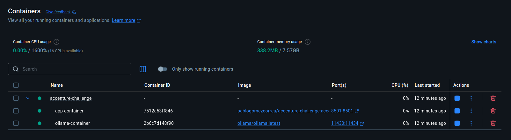

# Tecnologias utilizadas

## Aplicação
* Python
* LangChain
* Embeddings
* TextSplitter
* Ollama
  * LLM (llama3.1)
* Streamlit
  * Frontend responsável pela visualização do chat

## Infraestrutura
* Docker Compose

## Pacotes
Todas as bibliotecas estão listadas no requirements.txt 

## Docker
Para o deploy da aplicação, foi criado um docker-compose.yaml que irá fazer 
todo o processo automaticamente. O comando à ser executado segue abaixo, ele deve ser
executado na raiz da aplicação

<code>
docker compose up -d build
</code>

Após finalizar o processo de deploy, será possível visualizar dois containers



É necessário aguardar alguns minuto até que o modelo seja baixado noo Ollama automaticamente, 
é possível visualizar nos logs

## Teste
Para criar os containers e inicializar a aplicação na Docker:

```
docker compose up -d build
```
Para acessar a aplicação segue a URL:
```
http://localhost:8501/
```
Em seguida será exibida a tela do sistema, onde será exibido um chat, 
aonde você poderá interagir com uma IA agente de vendas.

## Tela do Sistema


## Resumo
O objetivo da aplicação, foi desenvolver um agente de vendas, que iria realizar análises baseadas nos 
dados disponibilizados no arquivo **sales.csv**.
As técnicas que apliquei, além de um pouco de engenharia de prompt, 
foi utilizado FAISS para armazenar e buscar embeddings à partir do CSV 

**Author:** Pablo Gomes Corrêa  
**Date:** 11/08/2025  
**Email:** pablogomezcorrea@gmail.com
